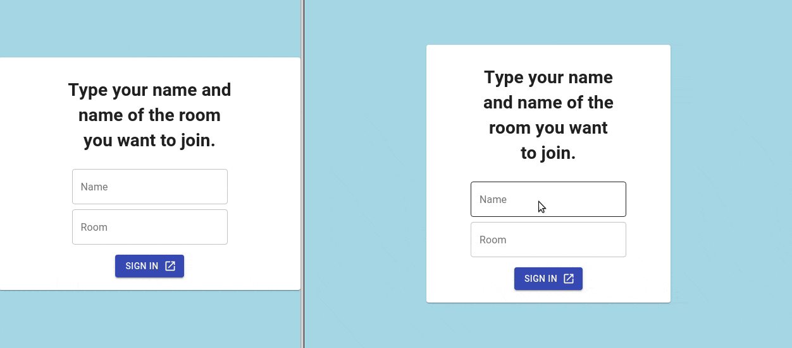

# Chatting App
## Description
Real time chatting web application.  
To deal with sending messages in real time, the application connects to the server on which webhooks are implemented.
## Preview
Website is hosted on Netlify and it's available for [preview].
___


## Installation
Clone this repository and install dependencies inside project directory.
```
git clone https://github.com/Wojciech-Florczak/chatting-app-client.git
cd chatting-app-client
npm install
```
## Configuration
By default, app connects to server deployed by me on heroku.  
To specify your own endpoint edit ENDPOINT variable in Chat component.
```javascript
  const ENDPOINT = "your-server-address";
```
Server source code is available in my [chatting-app-server](https://github.com/Wojciech-Florczak/chatting-app-server) repository
## Usage
To run this project in development mode use:
```
npm start
``` 
___
This project was bootstrapped with [Create React App](https://github.com/facebook/create-react-app).

[preview]: https://stoic-lamport-fac389.netlify.com